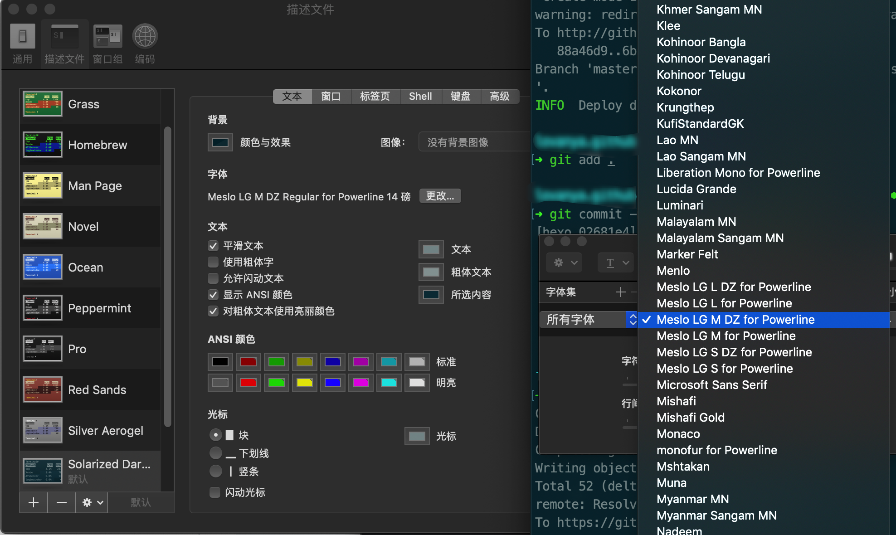
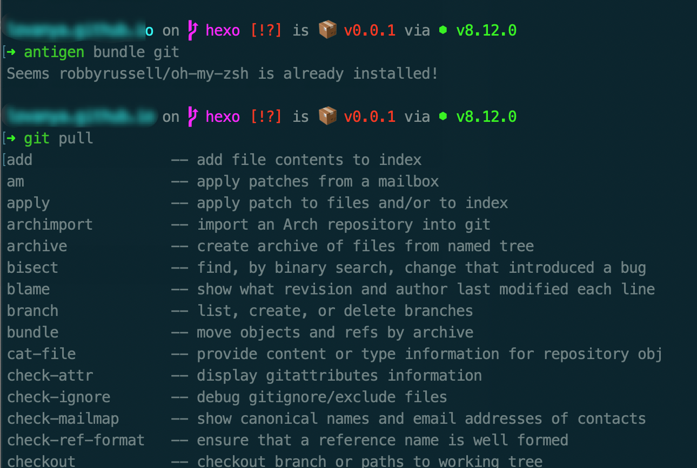

### 安装 zsh

```bash
brew install zsh
# 安装完成后
zsh --version
# 显示类似zsh 5.1.1，则表示安装成功
# 切换默认的shell为zsh
chsh -s $(which zsh)
# 重启下终端
```


### 安装 Oh My Zsh

```bash
# 如果没有安装 git，要先安装
brew install git
# 安装完后，开始安装 oh my zsh
sh -c "$(curl -fsSL https://raw.github.com/robbyrussell/oh-my-zsh/master/tools/install.sh)"
# 安装完后，应该能看到终端窗口内容显示的变化
```

### 安装 angtigen

> [A plugin manager for zsh, inspired by oh-my-zsh and vundle.](http://antigen.sharats.me/)

```bash
curl -L git.io/antigen > antigen.zsh
# or use git.io/antigen-nightly for the latest version
```

安装完成后，删除原来的 .zshrc 文件，新建一个

```bash
rm ~/.zshrc
touch ~/.zshrc
```

将下列内容复制后粘贴到新的 .zshrc 中并保存

```bash
source ~/antigen.zsh

# Load the oh-my-zsh's library.
antigen use oh-my-zsh

# Bundles from the default repo (robbyrussell's oh-my-zsh).
antigen bundle brew
antigen bundle command-not-found
antigen bundle docker
antigen bundle docker-compose
antigen bundle gem
antigen bundle git
antigen bundle golang
antigen bundle ng
antigen bundle osx
antigen bundle pip

# Syntax highlighting bundle.
antigen bundle zsh-users/zsh-syntax-highlighting
antigen bundle zsh-users/zsh-completions
antigen bundle zsh-users/zsh-autosuggestions
antigen bundle zsh-users/zsh-apple-touchbar

# Load the theme.
# antigen theme robbyrussell
antigen theme https://github.com/denysdovhan/spaceship-prompt spaceship

# Tell Antigen that you're done.
antigen apply
```

保存后，执行下该文件

```bash
source ~/.zshrc
```

### 为 spaceship 主题安装字体 Powerline fonts

```bash
# clone
git clone https://github.com/powerline/fonts.git --depth=1
# install
cd fonts
./install.sh
# clean-up a bit
cd ..
rm -rf fonts
```

安装完成打开终端的 偏好设置 -> 描述文件 -> 字体，并选择 Meslo LG 系列字体中的一个，这个时候终端里面的乱码问题就解决了。



这样就大功告成了😎

